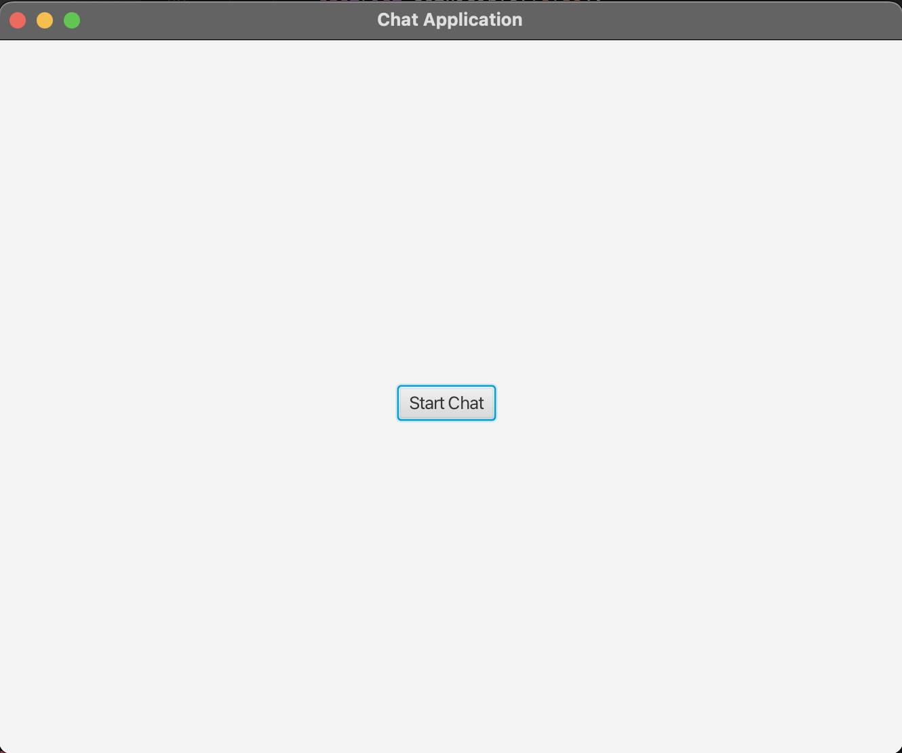
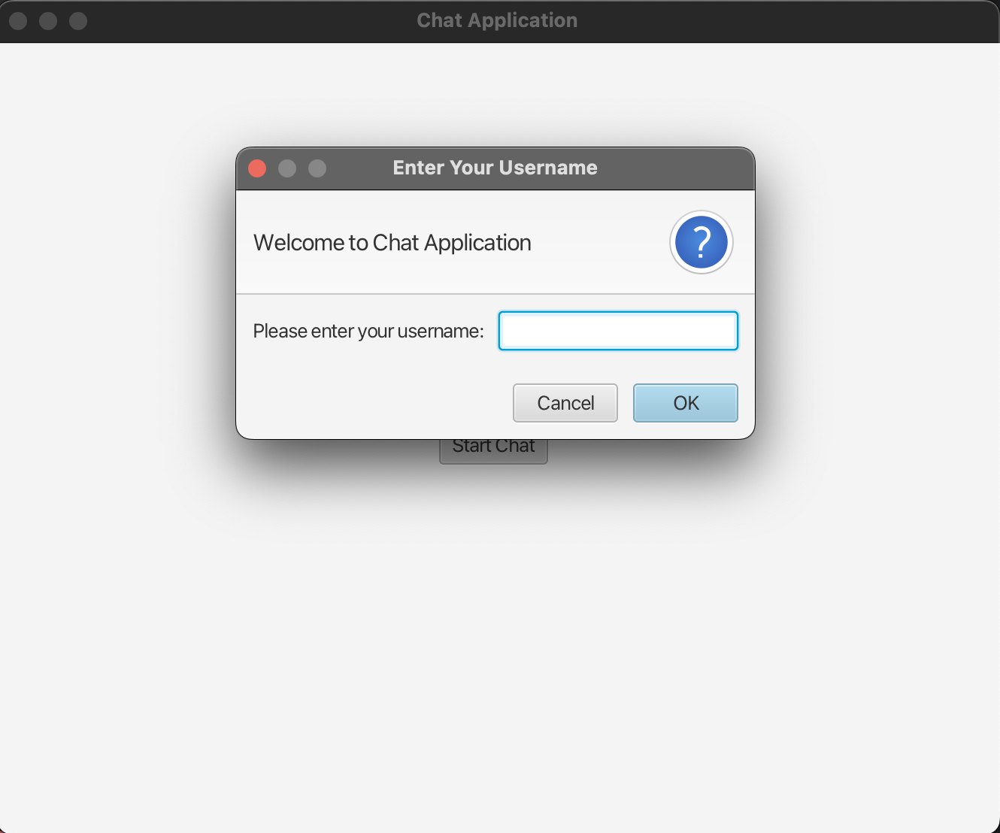
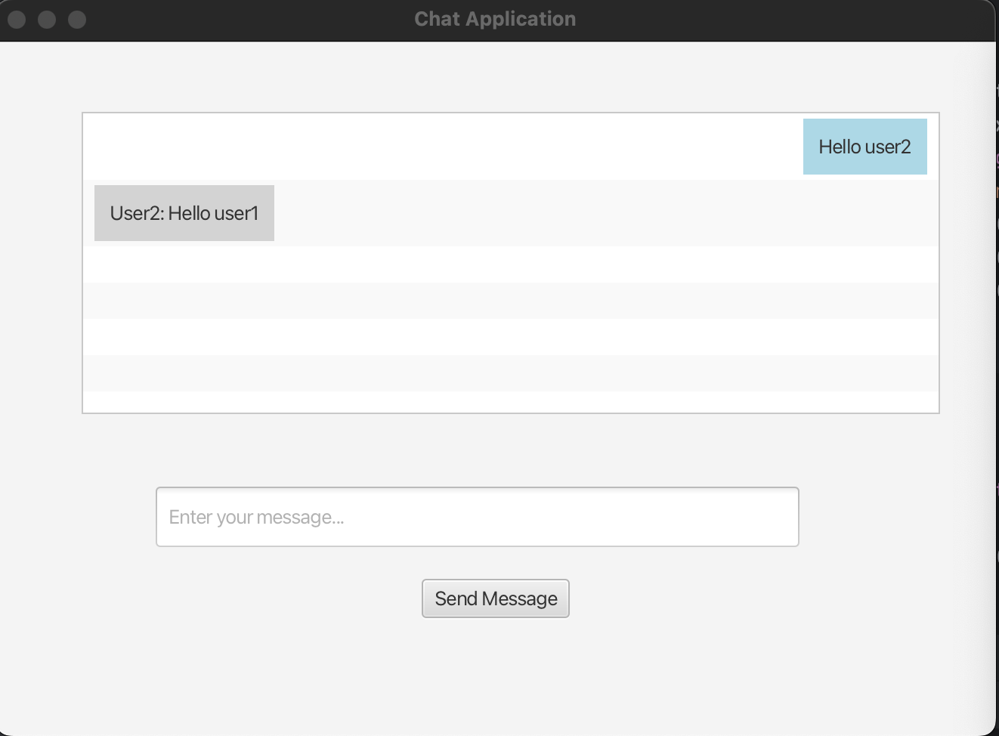
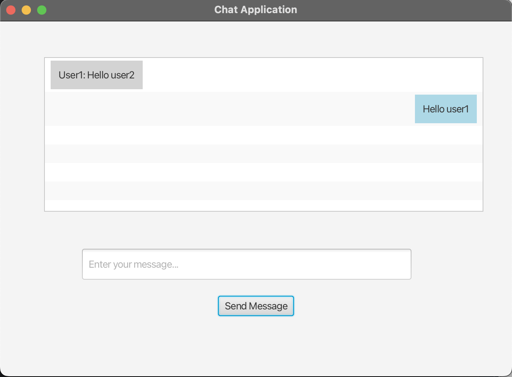

# JavaFX Basic Chat Application

This is a basic **chat application** built using **JavaFX** for the user interface and **sockets** for network communication between a server and clients. The server uses multithreading through the `ClientHandler` class, allowing it to handle multiple clients simultaneously.

## Screenshots






## Technologies Used

- **JavaFX 21** for the graphical user interface (GUI)
- **Java Sockets** for network communication
- **Multithreading** for handling multiple clients

## Project Structure

- **Server**: Listens for client connections and broadcasts messages to all connected clients.
- **Client**: Connects to the server and sends/receives messages.
- **ClientHandler**: Runs in a separate thread for each connected client, ensuring the server can handle multiple clients concurrently.

## Features

- Multiple clients can connect to the server at the same time.
- Real-time message broadcasting to all connected clients.
- GUI implemented using JavaFX.
- Clients are informed when another client leaves the chat.

## How It Works

1. The **server** waits for incoming connections from clients.
2. Each client runs in its own thread (via **ClientHandler**), allowing simultaneous messaging.
3. When a client sends a message, the server broadcasts it to all other connected clients.
4. The server manages connections, sending notifications when a client connects or disconnects.

## Setup and Usage

1. Clone the repository:
   ```bash
   git clone https://github.com/Plavsic01/ChatApplication.git
   ```
2. Start Server
3. Start ChatApplication
